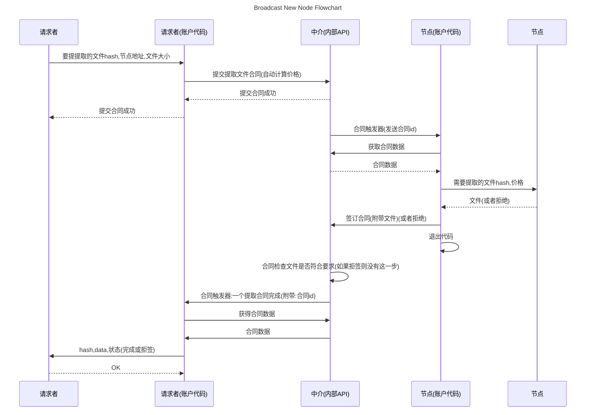
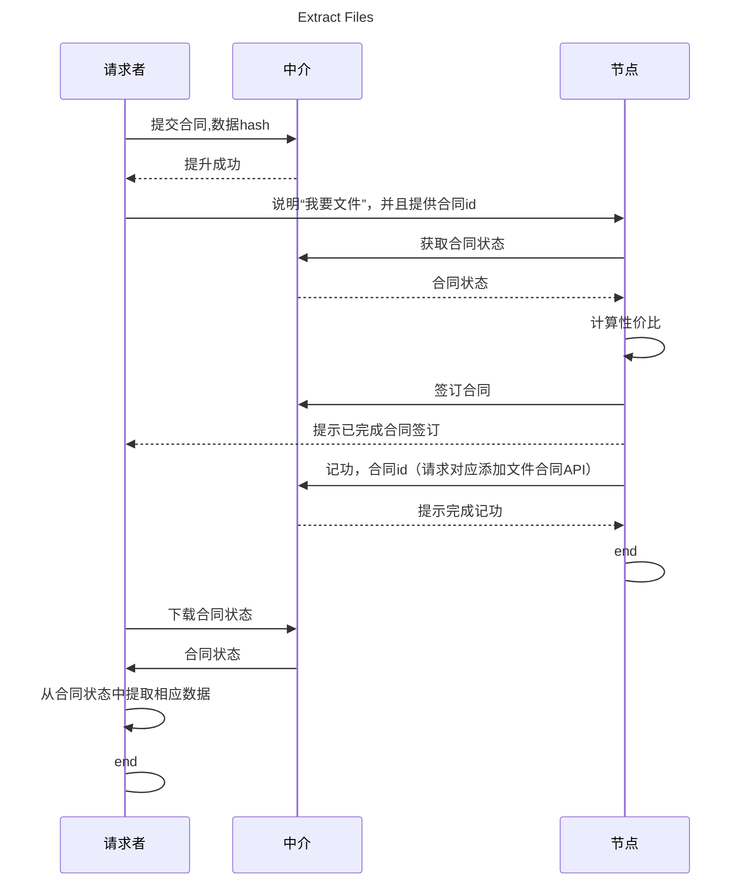
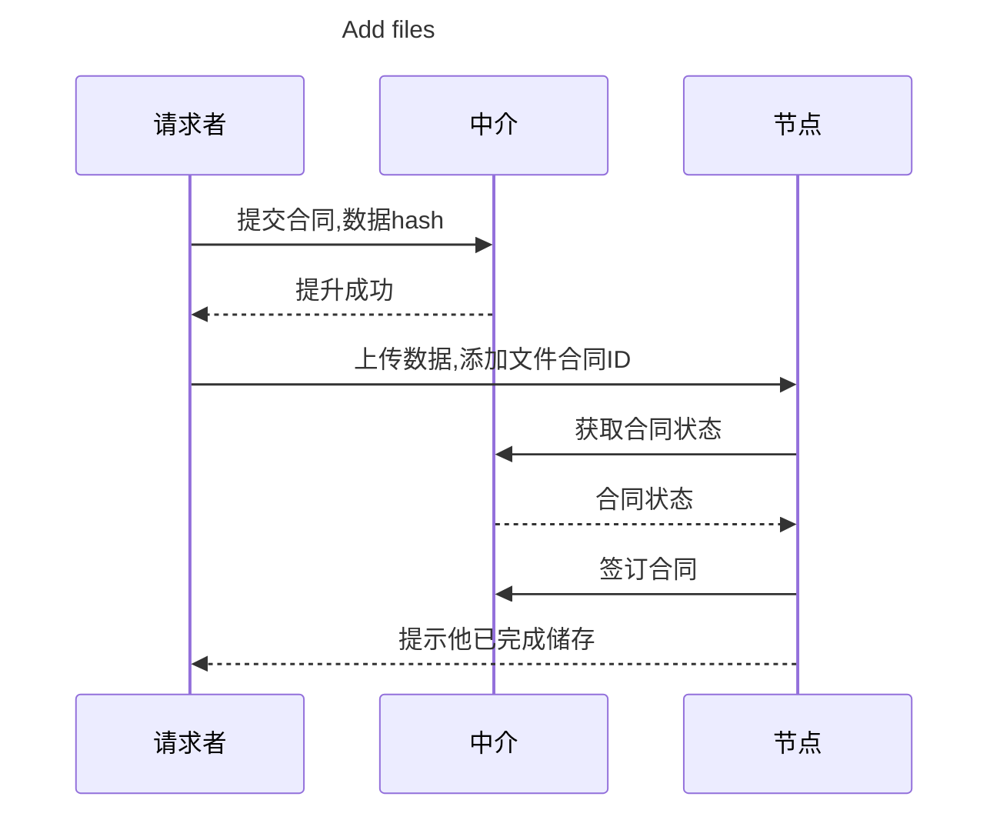

## RuxuShiiYuen :一个基于中介的开放式储存市场 (第三版)
<b>by シーン ホゥオン シー ジー (2023)</b>

## 简介

为了使分布式技术得到更加广泛的应用,使得计算机资源更加自由的买卖,以更加低价流通,更加方便的获取,以实现资源的最大化利用,以及更低的成本,本文提出了一种基于中介的开放式储存市场,以实现储存资源的自由流通,以及储存资源的成本的降低.

## 内容

本文首先介绍了分布式储存的发展历史,以及分布式储存的现状,然后介绍了本文提出的开放式储存市场的概念,以及其实现方式,最后介绍了本文提出的开放式储存市场的应用场景,以及本文提出的开放式储存市场的经济模型.

## 目录

[1. 引言](#1-引言)

[2. 分布式储存的发展历史](#2-分布式储存的发展历史)

[3. 本文提出的开放式储存市场的概念](#3-本文提出的开放式储存市场的概念)

[4. 本文提出的开放式储存市场的实现方式](#4-本文提出的开放式储存市场的实现方式)

[5. 本文提出的开放式储存市场的应用场景](#5-本文提出的开放式储存市场的应用场景)

[6. 本文提出的开放式储存市场的经济模型](#6-本文提出的开放式储存市场的经济模型)

[7. 总结](#7-总结)

[8. 作者的话](#8-作者的话)

[9. 参考文献](#9-参考文献)

## 1. 引言

随着互联网的发展,以及云计算的发展,分布式技术得到了越来越广泛的应用,分布式技术可以实现资源的自由流通,以及储存资源的成本的降低.

本文首先介绍了分布式储存的发展历史,以及分布式储存的现状,然后介绍了本文提出的开放式储存市场的概念,以及其实现方式,最后介绍了本文提出的开放式储存市场的应用场景,以及本文提出的开放式储存市场的经济模型.

## 2. 分布式储存的发展历史

分布式储存的发展历史可以追溯到计算机网络的早期阶段。下面是分布式储存的主要发展历程：

1. 早期的分布式文件系统：20世纪70年代和80年代，分布式文件系统开始出现。这些系统允许多台计算机通过网络共享和访问文件，如NFS（Network File System）和AFS（Andrew File System）。

2. 对等网络和P2P技术：在20世纪90年代和2000年代初，对等网络和P2P（Peer-to-Peer）技术的兴起推动了分布式储存的发展。这些技术允许用户直接共享和交换文件，而无需依赖中心化的服务器。著名的P2P应用包括BitTorrent和eDonkey。

3. 云存储和对象存储：随着云计算的兴起，云存储成为一种主流的分布式储存方式。云存储提供了可扩展的存储基础设施，用户可以将数据存储在云服务提供商的服务器上，并通过网络进行访问。同时，对象存储也逐渐成为云存储的主流形式，它以对象为单位存储数据，并提供高度可扩展性和数据冗余。

4. 区块链和去中心化存储：近年来，区块链技术的发展为分布式储存带来了新的可能性。去中心化存储通过将数据分布在网络中的多个节点上，实现数据的安全性和可靠性。区块链技术的不可篡改性和分布式共识机制也为去中心化存储提供了更高的安全性和信任度。

总的来说，分布式储存经历了从早期的分布式文件系统到云存储和对象存储的发展，最近又出现了区块链和去中心化存储的趋势。这些发展推动了分布式储存的可扩展性、安全性和可靠性的提升，并为用户提供了更灵活和可靠的数据存储解决方案。

## 3. 本文提出的开放式储存市场的概念

这是一个基于可靠中介的开放式储存市场，其独特之处在于用户和储存节点之间的交易过程中存在一个中介机构`可以是智能合约,也可以是中心化机构`，该中介机构提供可靠的保障。与其他类似的储存市场不同，这个市场的中介不仅仅是提供交易撮合的角色，还会同时保护用户的既得利益。

在这个市场中，用户和储存节点可以自由地进行交易。用户可以发布存储需求，并与合适的储存节点达成交易协议。而中介机构在交易过程中扮演着重要的角色，确保交易的可靠性和安全性。

中介机构的存在为用户和储存节点提供了额外的保障。它可以监督交易的执行过程，确保双方遵守协议，并解决任何可能出现的争议或纠纷。中介机构还会对储存节点进行审核和评估，确保它们符合市场的要求和标准，从而提供可靠的储存服务。

与像Storj这样的储存市场不同，这个市场更加注重中介的角色。中介机构在交易中扮演着保护用户利益的角色，确保用户在交易过程中获得公平和可靠的待遇。这种基于可靠中介的市场模型可以提高用户的信任度，促进更多的交易和参与。

同时，中介机构在这个开放式储存市场中还具备根据用户需求自动执行既定操作的能力。这意味着中介机构可以根据用户的要求，在交易过程中自动执行一些特定的操作，以提供更便捷和高效的服务。

例如，当用户发布存储需求时，中介机构可以自动匹配合适的储存节点，并执行数据备份和冗余操作(可以在本地执行也可以在中介执行)，以确保数据的安全性和可靠性。中介机构还可以根据用户的需求，自动进行数据加密、压缩或解压缩等操作，以满足用户的个性化需求。

但是使用中介机构进行交易可能会产生额外的交易费用。用户在选择中介机构时应该综合考虑交易费用和其他因素，以确保自己能够获得合理的交易成本和良好的交易体验。

总而言之，这个基于可靠中介的开放式储存市场通过提供中介保障，确保用户和储存节点之间的交易安全可靠。中介机构的存在为用户提供了额外的保护，使他们能够放心地参与市场交易，并获得既得利益的保障。并且，中介机构在这个开放式储存市场中不仅仅扮演着保障用户利益的角色，还具备根据用户需求自动执行既定操作的能力。通过自动化操作，中介机构可以提供更加便捷和高效的储存服务，满足用户的个性化需求，并提升整个市场的效率和稳定性。

## 4. 本文提出的开放式储存市场的实现方式

### 角色
#### 中介
中介最重要的是作为一个交易保障平台和自动化安全可以执行代码平台,处理合同. 用于保障整个市场的信用,可以为最可靠的智能合约,或者中心化机构.

#### 服务提供者 (节点)
服务提供者是储存节点, 负责储存数据, 并可以提供数据服务.

#### 请求者
请求者是用户, 负责储存需求, 并可以请求数据服务.

### 通信与加密

在请求者和中介之间,请求者和节点之间,保证请求者的身份特别重要;因为请求者通常不会有固定的地址,所以就不能使用通信地址来保证身份,如果使用密码,那么密码就可能被泄露,所以使用公钥来保证身份是必要的.（节点不可能拿到用户名和密码来验证请求者身份吧？）

#### 非对称加密

什么是非对称加密？
非对称加密，也称为公钥加密，是一种加密方式，相对于对称加密，它使用两个不同的密钥，一个公钥和一个私钥。公钥可以公开，任何人都可以使用它来加密消息，但只有私钥的持有者才能将其解密。

在非对称加密中，公钥和私钥是一对密钥，它们是由数学算法生成的。公钥可以被广泛分发，而私钥则必须保密。当A想要给B发送加密消息时，A使用B的公钥对消息进行加密，然后将密文发送给B。B收到密文后，使用自己的私钥进行解密，得到原始的消息。

###### 非对称加密具有以下特点：

1. 安全性高：非对称加密使用不同的密钥进行加密和解密，相对于对称加密，更加安全，因为攻击者无法从公钥中推断出私钥。
2. 公钥分发方便：公钥是公开的，任何人都可以使用它来加密消息，因此公钥的分发相对来说更加方便。

###### 非对称加密的工作原理是什么？
非对称加密的工作原理是基于数学算法的。它使用两个不同的密钥，一个公钥和一个私钥。公钥可以公开，任何人都可以使用它来加密消息，但只有私钥的持有者才能将其解密。


#### 数字签名

数字签名是一种用于验证消息完整性和身份认证的技术，它使用非对称加密算法中的私钥来生成签名，而不是进行加密。

数字签名的过程如下：
1. 发送方使用私钥对要发送的消息进行哈希运算，生成消息摘要。
2. 发送方使用私钥对消息摘要进行加
密，生成数字签名。
3. 发送方将消息和数字签名一起发送给接收方。

接收方在接收到消息后，可以使用发送方的公钥来验证数字签名的有效性，并确保消息的完整性和发送方的身份认证。验证数字签名的过程如下：
1. 接收方使用发送方的公钥对数字签名进行解密，得到解密后的消息摘要。
2. 接收方对接收到的消息进行哈希运算，生成新的消息摘要。
3. 接收方比较解密后的消息摘要和新生成的消息摘要，如果两者一致，则说明数字签名有效，消息没有被篡改，并且发送方的身份得到了认证。

使用私钥生成数字签名，用于验证消息的完整性和身份认证。

#### 数字签名在本项目的作用

中介和节点在收到一个请求时会首先验证请求者的身份, 然后验证请求者的身份是否合法, 合法则将请求者的请求作为有效请求进行处理, 否则拒绝请求.

节点和中介也会使用数字签名进行通信, 保证通信的安全性.

### 账户

因为在买卖过程中涉及到价值交换,价值交换一定会有个交换对象,这个对象便是账户,账户基本数据有五种,一是公钥,二是私钥,三是身份,四是备注,五是余额;但是一个账号在链接其他系统的时候也会在其他系统产生对应的数据,比如合同

同时在自动化处理中,账户也是必要的,这用于区分处理时的身份

#### 身份简述

身份是一个集合,其中包含了你拥有的所有身份,例子:
```
{
    '外部持有账户', // 这一类有 : 外部持有账户和中介内部账号
    'xxxxx(合同id)合同签订者',
    'xxxxxx(节点名)拥有者',
}
```
#### 账户使用成本(交易费)

用户使用中介的时候一定会产生一些资源消耗,会有内存硬盘的占用,如果中介是中心化机构,账户使用成本那么将由中心化机构自行扣除,如果使用的是智能合同的区块链应用,则以交易费为准
`用了不交钱?想屁吃,又不是做公益`

#### 账户代码

账户代码是上文讲到的`根据用户需求自动执行既定操作的能力`形式之一,它能代替用户签名与节点交互,它能通过API触发与外界交互,它能通过合同签订触发自动完成合同

账户代码运行在中介上,由用户自己编写(或者调用)部署,账户代码需要一个触发器,触发器会给与账户代码必要的数据,触发器可以有多种,如:"API触发","合同触发",目前也只打算支持这两种.

账户代码发送的请求代表着账户本身,会有`账户代码`的独特标识,这样子可以更好的把各种系统联系起来,更高效的解决用户需求,但是会增加交易费

示例:提取文件


### 合同  
价值交换需要一个绝对可以执行的约定，而约定少不了各种逻辑判断，因此合同实际是一个可以进行状态转移的一个机器在启动的时候使用一些东西（或不用）来初始化状态在运行中进行状态的转移，在结算时根据状态来决定价值转移的方向和额度。因此可以得出，合同是一个固有价值，可以由外界的触发来进行（或不进行）相应的状态转移，最后根据合同状态来决定如何将自身进行转移的“机器”。  

为了实现这个机器可以基于下面的要求进行开发、  
1. 合同不可违的，值签订，合同将被严格执行 
2. 合同要有自己的储存，计算资源，用于改变合同状态。  
1. 合同要给外界触发进行状态转移，因此应有一些“合同API”
1. 合同有自己拥有的金额
1. 外界可以获取合同的状态，特别是合同鉴定的甲方和乙方，以便根据合同的状态来判断是否进行操作。
1. 合同可以被自由书写（但在这里只能用官方判定的模板套用书写）（用代码写合同）根据这些要求可以得出更深一层的概念：
##### 合同代码
一个合同在一些代码，这些代码负责处理“合同APi" 调用，通过更改合同储存来改变合同的状态，在合同结束时计算出价值转移的方向和额度，因此可以分类合同代码。
##### 初始化代码
这种代码在提交时执行执行它可以接受初始化参数进行一些操作,初始化参数由提交者(甲方)提供.  

##### 签定代码：
在合同签订时执行（即确认乙方时），它可以接受签定参数，签定参数由乙方提供，它还可以决定合同主逻辑是否在签定完成后就立刻执行主逻辑  
#### 合同主逻辑代码
在完成了初始化和签定后 以及达到合同执行的几种形式开始执行后运行的代码：如果有合同API合同就会由API回调代码结算或到后期结算，如果没有合同API将执行合同代码直到执行到EXIT()或执行完毕，合同API由外部API调用所有人都可以调用合同API但合同API也有调用后不作出任何行动的权力。主逻辑代码可以在运行结束后强制结算。
##### 结算代码
在满足条件后执行的代码，可以根据合同状态来分配合同自身价值流向甲方还是乙方，额度是多少。
##### 合同提交
合同在提交人提交后进行初始化可以在初始时提供必须数据
##### 合同签订
可以在签订合同时成为合同乙方，可以在签订时提供必须数据，
##### 合同执行
合同执行即合同主逻辑的执行合同执行需满足一些条件即：
1. 合同已经签订
1. 到达此前约定时间或签订后强制执行垎合同
##### 合同结算
合同执行后进行计算需满足一定条件：
1. 合同已执行
1. 到达结算时间或到达合同过期时间或主逻辑结束后前置结算
##### 合同公开性
有些时候合同需要具备一定公开性。一是签订对象的广泛性：二是合同对象的公开性：三是合同API调用的公开性，这已经在前面解决了。  
（I） 签订对象的支持：合同支持1对1、1对多、多对多、即甲——乙 或 甲（1）甲（2）——乙 或 甲（1）甲（2）——乙（1）乙(2)  
合约代码会对签订的对象进行支持  
（II）签订对象的广泛性、指定签订对象、即甲乙两方固定，面向一个群体，即甲乙方固定面向一个群体，即甲属于<甲方群体>甲属于甲方群体 乙属于<乙方群体>或者甲，乙<某个群体>  
（3）面向共有、即甲、乙、<所有人>。
（III）合同状态查询公开性：  
可以用表达式来表示，如A属于{甲，乙}（或A属于甲∪乙
A属于<节点运营商>∩<中国>……
合同信息汇总：经过了上文的各种概念可以得出合同要什么信息在此汇总
1. 甲方列表
1. 乙方列表
1. 合同储存
1. 合同模板ID
1. 合同ID
6. 合同提交时间
1. 合同执行结果（结算结果）
1. API调用记录
1. 预定结算时间、执行时间
1. 签定证明（用私钥加密的我在XXX时签定XXX合同在XXX方块和公钥）  
1. 合同价值（合同金额）
1.  合同公开性
1. 过期时间（销毁时间）
##### 合同模板
提交任何合同之前都确定合同写什么，即合同模板，它类似下面
1. 拟定甲方列表格式
1. 拟定乙方列表形式
1. 合同代码
1. 拟定合同价值
1. 拟定合同公开性
1. 拟定结算时间执行时间（预定）
1. 公钥匙的加密时间，
1. 其他信息
##### 合同意义
合同在开放式储存市场中具有重要的意义。它是交易的约定，确保交易的可靠性和安全性，并规定了交易双方的权益和责任。以下是合同的一些重要意义：

1. 约定权益和责任：合同明确了交易双方的权益和责任，包括数据储存的期限、价格、数据安全性等。通过合同的签订，可以确保交易双方的权益得到保护，并减少纠纷的发生。

2. 保障数据安全和可靠性：合同规定了数据储存的要求和标准，包括数据备份、冗余、加密等措施。通过合同的执行，可以确保数据的安全和可靠性，防止数据丢失或被篡改。

3. 规范交易流程：合同规定了交易的流程和条件，包括合同的签订、执行和结算等。通过合同的约束，可以规范交易流程，提高交易的效率和可靠性。

4. 提供争议解决机制：合同规定了争议解决的机制和程序，包括仲裁、调解等方式。通过合同的约定，可以提供一种公正、公平的争议解决机制，保障交易双方的权益。

5. 促进市场发展：合同为市场参与者提供了一种可靠的交易方式，增加了市场的透明度和可信度。通过合同的约束，可以促进市场的发展，吸引更多的参与者和资源。

总之，合同在开放式储存市场中具有重要的意义，它是保障交易安全和可靠性的重要工具，也是促进市场发展的重要手段。通过合同的约定和执行，可以建立一个公正、公平、可信的储存市场，为用户提供更好的储存服务。

### 服务提供者（节点）
节点由外部持有账户控制，节点友谊个节点名和对应的节点地址，成为节点要进行注册，

1. 节点注册：通过联系中介节点管理处理等方式让节点管理提交一份节点注册合同，乙方为节点拥有者节点拥有者提供相应的坚定信息（有可能要交钱）后合同执行，会给所有者添加:"节点所有者","XX 节点所有者","XX(名称)节点所有者的具体身份",并在账户备注中添加{<节点名>:<节点地址>}合同结算时会去除节点所有者身份".(节点名称示例:星织的巨形储存节点——`UUID`).  
2. 注册合同：它有提前计算，更改节点地址，更改类型等功能
3. 节点类型：储存，计算，储算（目前可以想到的）
## 5-本文提出的开放式储存市场的应用场景  
### 数据储存

这里的数据储存单单指的是基本的基于hash的储存，不包括比hash索引更高级别的索引，所以也不包括数据在全网的索引。

使用储存需要与节点签订相应的储存相关的合同，这种合同通常由请求者提交，节点进行签订。

#### 提取数据

###### 数据提取合同（单对单）模板：
```
甲方 = 请求者自己;
乙方 = 单一 储存节点 or 缓存节点;
执行时间 = 签订后执行（强制性）;
结算时间 = 主逻辑结束后结算（强制性）;
结算 = 合同价值全都转移到乙方;
API:无;
状态对公性：对甲乙方开发（包括未签订时）;
初始化条件：文件hash;
签订条件：乙方提供的数据的hash值正确;
```

###### 提取文件时序图



#### 添加数据

###### 数据储存合同（单对单）（添加文件合同）模板：
```
甲方 = 请求者自己;
乙方 ∈ <所有储存节点> and 乙方 = 单一储存节点;
执行时间 = 签订后执行（强制性）;
结算时间 = 自定义（储存多少周呢？）;
结算 = 记功（详细见下文）;
API:1.记功API，需要合同ID　;
状态对公性：对甲乙方开发（包括未签订时）;
初始化条件：文件hash;
签订条件：自定义;
```
###### 添加文件时序图


通过这些方式来进行数据提取和储存，可以有效保证市场公平。
### 数据索引  
在不知道文件所处节点和不知文件HASH的时候，文件几乎是无法找回的，"路西原"也因此会开发官方数据索引服务,以便用户使用数据索引分为线索索引和本地索引类,在线索引也可以在本地的合同模拟器运行,合同代码均会开源如有精力也会将独立重构一份本地索引.  

###### hash to nobe index  
这是一份甲方乙方都是中介的合同,它没有结算时间,用户可以请求合同API来添加索引,任何人都可以添加,添加时需提供状态对索引形的数据存储合同ID,甲方API请求者即可完成填加,它的数据结构为{<hash>:[合同ID,合同A...]}
一个 hash 值对一个集合,集合中是储存这个hash合同ID们.  

###### 文件系统(fs):  
文件系统会加入一个其他数据,还有各种文件管理常用的API它一样还是一个合同,但不一样的是在客户,但不一样的是在客户端上会加入解密,自动获取文件,自动请求API等操作,它还可以管理多节点,合同只是一个云端备份工具和一个支持他人访问的工具  

###### 对象储存：  
对象储存是文件的升级版本（可以直接把对象储存套在虚拟驱动上）
数据索引会使得“路西原”更加易用，优雅。   
###### ipfs：待定
###### 星际数据库：待定  
### loseet代币相关  
为了更方便的进行数值交换，中介将使用代替EIA这类货币，因此支持“交易”每一个帐户都可以拥有一定数量的 loseet代币,loseet代币一般不会凭空产生只会在初期有所谓的送代币的用户福利，以半公益的状态进行，公益额度无了要“充钱“才可以使用使用，如”ETH“ ，”EOS“货币

### 数据储存扩展：分布式存储和数据冗余

这是一些结合数据索引和数据储存的内容

#### 分布式存储

分布式存储是一种将数据分散存储在多个节点上的存储方式。它具有以下优势：

1. 高可靠性：分布式存储将数据分散储存在多个节点上，当某个节点发生故障时，其他节点仍然可以提供数据访问服务，保证了数据的高可靠性。

2. 高性能：分布式存储可以并行地处理数据读写请求，在多个节点上同时进行数据访问，提高了存储系统的性能和吞吐量。

3. 可扩展性：分布式存储可以根据需求动态地添加或删除节点，实现存储容量的扩展和收缩，适应不同规模的数据存储需求。

4. 数据安全性：分布式存储通过数据冗余和备份机制，可以提供数据的安全性和可靠性。当某个节点发生故障时，其他节点上的数据可以作为备份进行恢复，保证数据的安全性。

#### 数据冗余

数据冗余是指将数据复制多份存储在不同的节点上，以提高数据的可靠性和可用性。它具有以下优势：

1. 数据备份：通过数据冗余，数据可以在多个节点上进行备份存储，当某个节点发生故障时，可以使用其他节点上的备份数据进行恢复，保证数据的安全性和可靠性。

2. 故障容忍性：数据冗余可以提高系统的故障容忍性，当某个节点发生故障时，其他节点上的数据仍然可用，保证了系统的可用性和连续性。

3. 加速数据访问：通过将数据复制到多个节点上，可以提高数据的访问速度。当用户请求数据时，可以从离用户最近的节点获取数据，减少了数据传输的延迟。

4. 数据一致性：数据冗余可以通过一致性协议来保证数据的一致性。当数据发生变化时，系统会自动将数据更新到所有节点上，保证数据的一致性和准确性。

综上所述，分布式存储和数据冗余是数据储存的重要扩展内容。它们可以提高数据的可靠性、可用性和性能，保证数据的安全性和一致性，为用户提供更好的数据存储服务。

## 7 总结  

在本书中，我们提出了一个基于中介的开放式储存市场的概念，旨在实现储存资源的自由流通和成本的降低。通过引入中介机构，我们可以保证交易的可靠性和安全性，并提供用户权益的保护。同时，我们还介绍了储存市场的经济模型，包括价格机制、奖励机制、惩罚机制和用户权益保护等关键因素。

在具体实现方面，我们提出了账户和合同的概念。账户是参与市场交易的主体，可以进行数据储存和提取等操作。合同是交易的约定，通过合同可以确保交易的可靠性和安全性。我们还介绍了合同的不同类型，包括数据储存合同和数据索引合同，并给出了相应的合同模板和时序图。

在应用场景方面，我们重点介绍了数据储存和数据索引两个方面。数据储存涉及到数据的提取和添加，通过合同的签订和执行，可以实现数据的安全储存和可靠提取。数据索引则是为了更方便地管理和查找数据，我们提出了hash to node index和文件系统两种索引方式。

最后，在作者的话中，我们总结了本书的主要内容和亮点，并展望了下一版的更新方向。我们希望通过本书的介绍，能够为开放式储存市场的建设和发展提供一些有益的思考和参考。

## 8 作者的话
这一版相对与第一版和第二版有更多的内容、更明确的定义、更成熟的方案更简单和更模块化的系统，提供更高的自由度，但在数据索引方面还缺少祥尽的解释，但这并不是本书的重点内容，因此给一个大致的方向而已。

本书对服务提供者（节点）下了更明确的定义而不是第一版一样更注重这个过程和设计要求，本书将系统实现的各种模块一一拆开并进行解释更明确的细分了“文件系统”和“存储介质”的概念，使得它更明朗，也更有利于开发，但本书对合同的应用没有讲解到位将在下一版更新。

本版对于存储节点中的缓存节点没能讲到，缓存节点可以减少主节点的宽带负担，同时也可以成为非服务器（24小时不间断贡献的节点）提供贡献的机会，未来版本将细讲。

本书对于很多实现上的细节都没有讲到，这些东西将在第三版出现，比如节点信用，交易保障梯度，还有类似storj需要卫星节点那种更低信用和更低费用的建议方式等等。
## 9 参考文献
以太坊白皮书：https://ethereum.org/zh/whitepaper/
storjv3白皮书： https://www.storj.io/storjv3.pdf
非对称加密：https://cloud.tencent.com/developer/techpedia/1797
比特币白皮书：https://bitcoin.org/bitcoin.pdf
## other content
</img>
Publish on https://github.com/Interstellar-database/RuxuShiiYuen
Contact :
📧 If you have any questions, suggestions, or collaboration inquiries, you can reach us through the following channels:
Email: Interstellar-database@outlook.com
GitHub : Interstellar-database Team
シーン ホゥオン シー ジー : xh-xhsz@foxmail.com
Thank you for your support to the Interstellar-database team! We look forward to creating and sharing a more fun and usable database project with you! 🌌✨🚀

