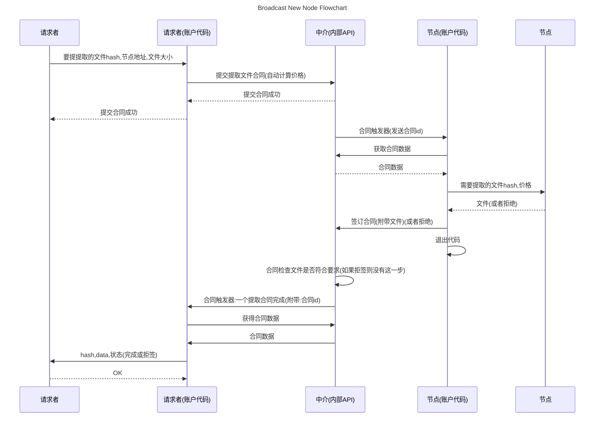

## RuxuShiiYuen :一个基于中介的开放式储存市场 (第二版)
by シーン ホゥオン シー ジー (2023)

## 简介

为了使分布式技术得到更加广泛的应用,使得计算机资源更加自由的买卖,以更加低价流通,更加方便的获取,以实现资源的最大化利用,以及更低的成本,本文提出了一种基于中介的开放式储存市场,以实现储存资源的自由流通,以及储存资源的成本的降低.

## 内容

本文首先介绍了分布式储存的发展历史,以及分布式储存的现状,然后介绍了本文提出的开放式储存市场的概念,以及其实现方式,最后介绍了本文提出的开放式储存市场的应用场景,以及本文提出的开放式储存市场的经济模型.

## 目录

[1. 引言](#1-引言)

[2. 分布式储存的发展历史](#2-分布式储存的发展历史)

[3. 本文提出的开放式储存市场的概念](#3-本文提出的开放式储存市场的概念)

[4. 本文提出的开放式储存市场的实现方式](#4-本文提出的开放式储存市场的实现方式)

[5. 本文提出的开放式储存市场的应用场景](#5-本文提出的开放式储存市场的应用场景)

[6. 本文提出的开放式储存市场的经济模型](#6-本文提出的开放式储存市场的经济模型)

[7. 总结](#7-总结)

[8. 作者的话](#8-作者的话)

[9. 参考文献](#9-参考文献)

## 1. 引言

随着互联网的发展,以及云计算的发展,分布式技术得到了越来越广泛的应用,分布式技术可以实现资源的自由流通,以及储存资源的成本的降低.

本文首先介绍了分布式储存的发展历史,以及分布式储存的现状,然后介绍了本文提出的开放式储存市场的概念,以及其实现方式,最后介绍了本文提出的开放式储存市场的应用场景,以及本文提出的开放式储存市场的经济模型.

## 2. 分布式储存的发展历史

分布式储存的发展历史可以追溯到计算机网络的早期阶段。下面是分布式储存的主要发展历程：

1. 早期的分布式文件系统：20世纪70年代和80年代，分布式文件系统开始出现。这些系统允许多台计算机通过网络共享和访问文件，如NFS（Network File System）和AFS（Andrew File System）。

2. 对等网络和P2P技术：在20世纪90年代和2000年代初，对等网络和P2P（Peer-to-Peer）技术的兴起推动了分布式储存的发展。这些技术允许用户直接共享和交换文件，而无需依赖中心化的服务器。著名的P2P应用包括BitTorrent和eDonkey。

3. 云存储和对象存储：随着云计算的兴起，云存储成为一种主流的分布式储存方式。云存储提供了可扩展的存储基础设施，用户可以将数据存储在云服务提供商的服务器上，并通过网络进行访问。同时，对象存储也逐渐成为云存储的主流形式，它以对象为单位存储数据，并提供高度可扩展性和数据冗余。

4. 区块链和去中心化存储：近年来，区块链技术的发展为分布式储存带来了新的可能性。去中心化存储通过将数据分布在网络中的多个节点上，实现数据的安全性和可靠性。区块链技术的不可篡改性和分布式共识机制也为去中心化存储提供了更高的安全性和信任度。

总的来说，分布式储存经历了从早期的分布式文件系统到云存储和对象存储的发展，最近又出现了区块链和去中心化存储的趋势。这些发展推动了分布式储存的可扩展性、安全性和可靠性的提升，并为用户提供了更灵活和可靠的数据存储解决方案。

## 3. 本文提出的开放式储存市场的概念

这是一个基于可靠中介的开放式储存市场，其独特之处在于用户和储存节点之间的交易过程中存在一个中介机构`可以是智能合约,也可以是中心化机构`，该中介机构提供可靠的保障。与其他类似的储存市场不同，这个市场的中介不仅仅是提供交易撮合的角色，还会同时保护用户的既得利益。

在这个市场中，用户和储存节点可以自由地进行交易。用户可以发布存储需求，并与合适的储存节点达成交易协议。而中介机构在交易过程中扮演着重要的角色，确保交易的可靠性和安全性。

中介机构的存在为用户和储存节点提供了额外的保障。它可以监督交易的执行过程，确保双方遵守协议，并解决任何可能出现的争议或纠纷。中介机构还会对储存节点进行审核和评估，确保它们符合市场的要求和标准，从而提供可靠的储存服务。

与像Storj这样的储存市场不同，这个市场更加注重中介的角色。中介机构在交易中扮演着保护用户利益的角色，确保用户在交易过程中获得公平和可靠的待遇。这种基于可靠中介的市场模型可以提高用户的信任度，促进更多的交易和参与。

同时，中介机构在这个开放式储存市场中还具备根据用户需求自动执行既定操作的能力。这意味着中介机构可以根据用户的要求，在交易过程中自动执行一些特定的操作，以提供更便捷和高效的服务。

例如，当用户发布存储需求时，中介机构可以自动匹配合适的储存节点，并执行数据备份和冗余操作(可以在本地执行也可以在中介执行)，以确保数据的安全性和可靠性。中介机构还可以根据用户的需求，自动进行数据加密、压缩或解压缩等操作，以满足用户的个性化需求。

但是使用中介机构进行交易可能会产生额外的交易费用。用户在选择中介机构时应该综合考虑交易费用和其他因素，以确保自己能够获得合理的交易成本和良好的交易体验。

总而言之，这个基于可靠中介的开放式储存市场通过提供中介保障，确保用户和储存节点之间的交易安全可靠。中介机构的存在为用户提供了额外的保护，使他们能够放心地参与市场交易，并获得既得利益的保障。并且，中介机构在这个开放式储存市场中不仅仅扮演着保障用户利益的角色，还具备根据用户需求自动执行既定操作的能力。通过自动化操作，中介机构可以提供更加便捷和高效的储存服务，满足用户的个性化需求，并提升整个市场的效率和稳定性。

## 4. 本文提出的开放式储存市场的实现方式

### 角色
#### 中介
中介最重要的是作为一个交易保障平台和自动化安全可以执行代码平台,处理合同. 用于保障整个市场的信用,可以为最可靠的智能合约,或者中心化机构.

#### 服务提供者 (节点)
服务提供者是储存节点, 负责储存数据, 并可以提供数据服务.

#### 请求者
请求者是用户, 负责储存需求, 并可以请求数据服务.

### 通信与加密

在请求者和中介之间,请求者和节点之间,保证请求者的身份特别重要;因为请求者通常不会有固定的地址,所以就不能使用通信地址来保证身份,如果使用密码,那么密码就可能被泄露,所以使用公钥来保证身份是必要的.（节点不可能拿到用户名和密码来验证请求者身份吧？）

#### 非对称加密

什么是非对称加密？
非对称加密，也称为公钥加密，是一种加密方式，相对于对称加密，它使用两个不同的密钥，一个公钥和一个私钥。公钥可以公开，任何人都可以使用它来加密消息，但只有私钥的持有者才能将其解密。

在非对称加密中，公钥和私钥是一对密钥，它们是由数学算法生成的。公钥可以被广泛分发，而私钥则必须保密。当A想要给B发送加密消息时，A使用B的公钥对消息进行加密，然后将密文发送给B。B收到密文后，使用自己的私钥进行解密，得到原始的消息。

###### 非对称加密具有以下特点：

1. 安全性高：非对称加密使用不同的密钥进行加密和解密，相对于对称加密，更加安全，因为攻击者无法从公钥中推断出私钥。
2. 公钥分发方便：公钥是公开的，任何人都可以使用它来加密消息，因此公钥的分发相对来说更加方便。

###### 非对称加密的工作原理是什么？
非对称加密的工作原理是基于数学算法的。它使用两个不同的密钥，一个公钥和一个私钥。公钥可以公开，任何人都可以使用它来加密消息，但只有私钥的持有者才能将其解密。


#### 数字签名

数字签名是一种用于验证消息完整性和身份认证的技术，它使用非对称加密算法中的私钥来生成签名，而不是进行加密。

数字签名的过程如下：
1. 发送方使用私钥对要发送的消息进行哈希运算，生成消息摘要。
2. 发送方使用私钥对消息摘要进行加密，生成数字签名。
3. 发送方将消息和数字签名一起发送给接收方。

接收方在接收到消息后，可以使用发送方的公钥来验证数字签名的有效性，并确保消息的完整性和发送方的身份认证。验证数字签名的过程如下：
1. 接收方使用发送方的公钥对数字签名进行解密，得到解密后的消息摘要。
2. 接收方对接收到的消息进行哈希运算，生成新的消息摘要。
3. 接收方比较解密后的消息摘要和新生成的消息摘要，如果两者一致，则说明数字签名有效，消息没有被篡改，并且发送方的身份得到了认证。

使用私钥生成数字签名，用于验证消息的完整性和身份认证。

#### 数字签名在本项目的作用

中介和节点在收到一个请求时会首先验证请求者的身份, 然后验证请求者的身份是否合法, 合法则将请求者的请求作为有效请求进行处理, 否则拒绝请求.

节点和中介也会使用数字签名进行通信, 保证通信的安全性.

### 账户

因为在买卖过程中涉及到价值交换,价值交换一定会有个交换对象,这个对象便是账户,账户基本数据有五种,一是公钥,二是私钥,三是身份,四是备注,五是余额;但是一个账号在链接其他系统的时候也会在其他系统产生对应的数据,比如合同

同时在自动化处理中,账户也是必要的,这用于区分处理时的身份

#### 身份简述

身份是一个集合,其中包含了你拥有的所有身份,例子:
```
{
    '外部持有账户', // 这一类有 : 外部持有账户和中介内部账号
    'xxxxx(合同id)合同签订者',
    'xxxxxx(节点名)拥有者',
}
```

#### 账户使用成本(交易费)

这个由中介运营商或者智能合约来定(使用中介不交钱想屁吃)

#### 账户代码

账户代码是上文讲到的`根据用户需求自动执行既定操作的能力`形式之一,它能代替用户签名与节点交互,它能通过API触发与外界交互,它能通过合同签订触发自动完成合同

账户代码运行在中介上,由用户自己编写(或者调用)部署,账户代码需要一个触发器,触发器会给与账户代码必要的数据,触发器可以有多种,如:"API触发","合同触发",目前也只打算支持这两种.

账户代码发送的请求代表着账户本身,会有`账户代码`的独特标识,这样子可以更好的把各种系统联系起来,更高效的解决用户需求,但是会增加交易费

示例:提取文件

